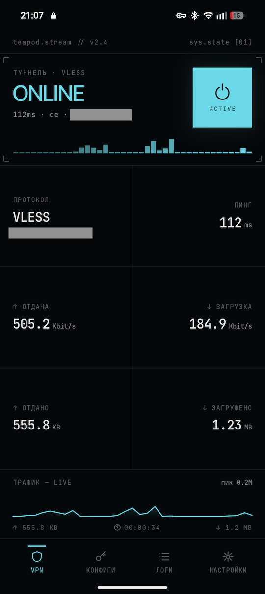
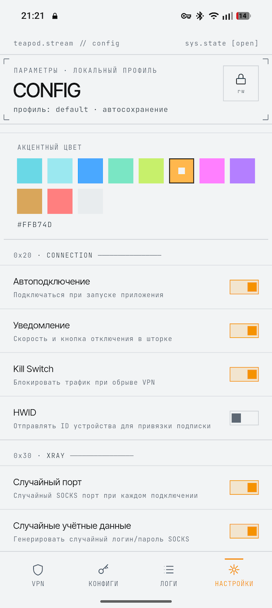

# TeapodStream

VPN-клиент для Android с поддержкой протокола Xray и интерфейсом TUN.

> [!WARNING]
> Во избежание недопониманий, коротко о сути проекта и планах
>
> Teapod Stream — это личный некоммерческий проект, главная цель которого — простота. Это не комбайн для гиков с сотней настроек, а просто удобный «человеческий» UI для VPN.
>
> Развитие клиента происходит по мере необходимости: код допиливается, когда автор сам сталкивается с какими-то багами или нюансами.
> - Приоритеты: проект на стадии набора базового функционала, поэтому минорные баги правятся в последнюю очередь.
> - Releases: здесь лежат стабильные сборки, которые автор уже обкатал на себе.
> - Pre-releases: активно разрабатываемые версии (всё может меняться и ломаться).

 

## Возможности

- Протоколы: **VLESS**, **VMess**, **Trojan**, **Shadowsocks**, **Hysteria2**
- Транспорты: **TCP**, **WebSocket**, **gRPC**, **H2**, **QUIC**, **xHTTP**, **HTTPUpgrade**, **SplitHTTP**
- Шифрование: **TLS**, **Reality** (включая post-quantum ML-DSA-65)
- Shadowsocks prefix proxy — обход DPI для серверов с параметром `?prefix=`
- TUN-интерфейс — весь трафик устройства идёт через VPN
- Режим «только прокси» — запуск SOCKS5-прокси без поднятия TUN-туннеля
- Раздельное туннелирование — исключение или включение конкретных приложений
- Kill switch — блокировка трафика при обрыве VPN-соединения
- Авто-подключение при запуске приложения
- Авто-переподключение при смене сети (WiFi → LTE и обратно)
- Подписки — автоматическое обновление конфигураций по URL (включая self-signed TLS)
- Geo-маршрутизация — правила bypass/direct по geoip/geosite и доменным зонам
- QR-сканирование для быстрого добавления конфигураций
- Статистика трафика в реальном времени

## Архитектура

Режим TUN (по умолчанию):
```
[Приложения] → [TUN-интерфейс] → [teapod-tun2socks] → [SOCKS5 127.0.0.1:port] → [xray-core] → [Сервер]
```

Режим «только прокси»:
```
[Приложение] → [SOCKS5 127.0.0.1:port] → [xray-core] → [Сервер]
```

- **xray-core** — ядро маршрутизации (XTLS/Xray-core)
- **teapod-tun2socks** — мост между TUN-интерфейсом и SOCKS5-прокси xray (AAR)
- **Android VpnService** — управление TUN-интерфейсом на уровне ОС

## Настройки

### Основные

| Параметр | По умолчанию | Описание |
|---|---|---|
| Автоподключение | выкл | Подключаться при запуске приложения |
| Kill switch | выкл | Блокировать трафик при разрыве VPN |
| Только прокси | выкл | SOCKS5 без VPN-туннеля (разрешения VPN не требуется) |
| Раздельное туннелирование | выкл | Включить/исключить конкретные приложения |

### SOCKS5

| Параметр | По умолчанию | Описание |
|---|---|---|
| Случайный порт | вкл | Случайный SOCKS5-порт при каждом подключении |
| SOCKS5 порт | 10808 | Фиксированный порт (когда случайный выкл) |
| Случайные учётные данные | вкл | Генерировать логин/пароль при каждом подключении |
| Логин / Пароль | — | Фиксированные учётные данные (можно оставить пустыми) |
| UDP | вкл | Пропускать UDP-трафик через SOCKS |

### DNS

| Параметр | По умолчанию | Описание |
|---|---|---|
| Режим DNS | Через VPN | `Через VPN` — резолв через xray DNS module; `Локальный` — системный резолвер напрямую |
| Блокировка QUIC | выкл | Запрещать UDP/443 для принудительного использования TCP |

### Подписки

- Поддержка base64 и plain-text форматов
- Подписки с self-signed TLS-сертификатами: приложение показывает диалог с информацией о сертификате
- Авто-обновление по расписанию (настраиваемый интервал)
- HTTP User-Agent: `TeapodStream/<версия> (Android; XrayNG-compatible) Xray-core/<версия>`

## Сборка

```bash
# Скачать бинарные зависимости (teapod-core.aar + geodata)
./build.sh binaries

# Сборка и запуск на подключённом устройстве
./build.sh run          # debug
./build.sh run-release  # release

# Только сборка
./build.sh debug    # debug APK
./build.sh release  # release APK (split-per-ABI)
./build.sh aab      # AAB для Google Play

./build.sh clean
```

### Требования

- Flutter SDK (Dart SDK 3.11+)
- Android SDK
- Java 21+

### Зависимости

Бинарные файлы загружаются автоматически при выполнении `./build.sh binaries`:
- [teapod-core](https://github.com/Wendor/teapod-core) (xray-core + teapod-tun2socks)
- [geoip.dat / geosite.dat](https://github.com/Loyalsoldier/v2ray-rules-dat)

## Тестирование

Unit-тесты минимальны. Основная верификация — запуск на устройстве.

```bash
flutter test   # запуск unit-тестов
flutter analyze
```

## Поддерживаемые архитектуры

- `arm64-v8a`
- `x86_64`
- `armeabi-v7a`

## Лицензия

Проект использует open-source компоненты:
- [Xray-core](https://github.com/XTLS/Xray-core) — MIT License
- [teapod-tun2socks](https://github.com/Wendor/teapod-tun2socks) — MIT License
